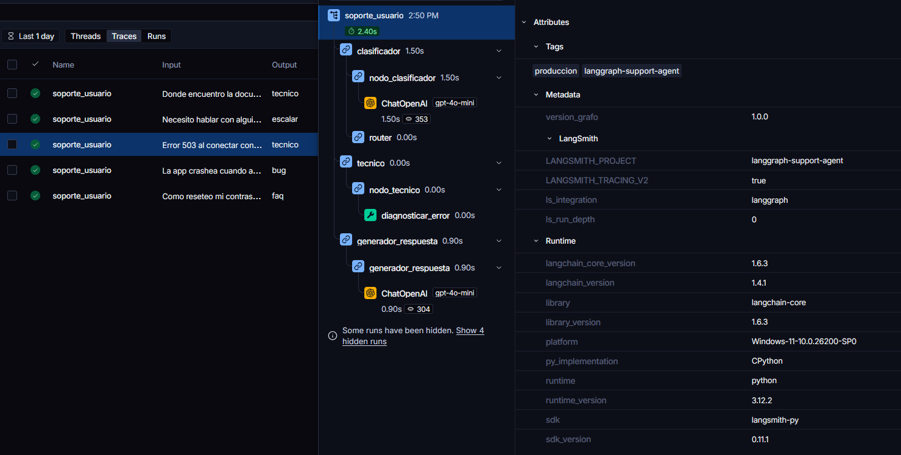
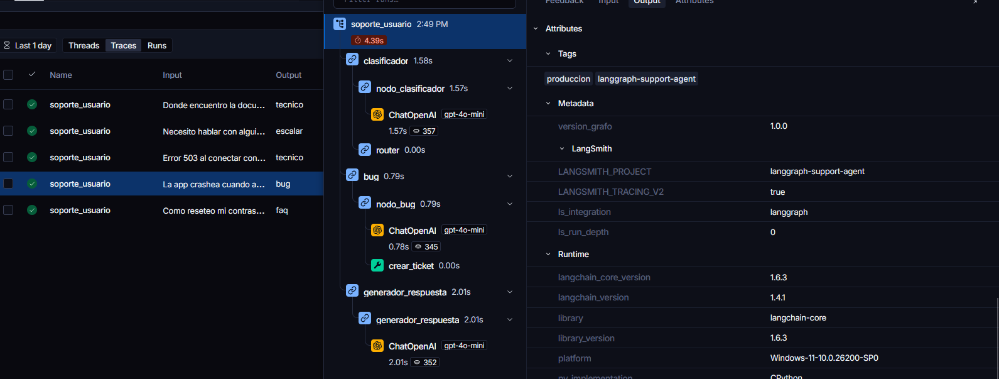
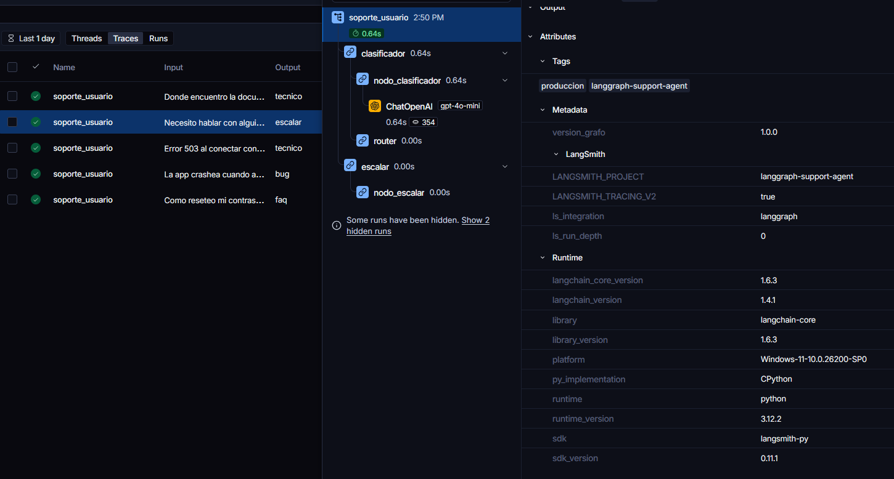
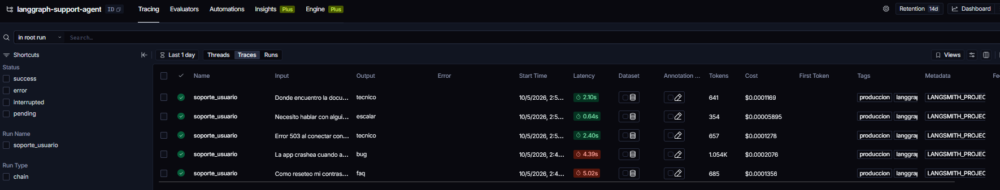

# LangGraph Support Agent

Agente inteligente de soporte técnico desarrollado con **LangGraph, LangChain, OpenAI y LangSmith**.

El proyecto implementa un sistema de soporte basado en grafos de estado capaz de clasificar las consultas de los usuarios, enrutar cada petición hacia un flujo especializado, utilizar herramientas cuando es necesario y generar respuestas contextualizadas.

Además, todo el flujo está instrumentado con **LangSmith**, permitiendo visualizar las ejecuciones, los nodos utilizados, las herramientas ejecutadas y las latencias de cada etapa.

---

## Características

* Clasificación automática de consultas mediante un LLM.
* Routing condicional mediante LangGraph.
* Flujos independientes para:

  * FAQ.
  * Reportes de bugs.
  * Consultas técnicas.
  * Escalado a un agente humano.
* Extracción estructurada de información de bugs.
* Creación simulada de tickets con identificadores únicos.
* Búsqueda simulada de documentación.
* Diagnóstico de códigos de error.
* Generación de respuestas finales contextualizadas.
* Trazabilidad completa mediante LangSmith.
* Registro de latencia individual por nodo.
* Cálculo de métricas de rendimiento.
* Suite de tests automatizados con pytest.

---

## Arquitectura

El flujo principal del agente es:

```text
                         ┌──────────────┐
                         │    START     │
                         └──────┬───────┘
                                │
                                ▼
                     ┌────────────────────┐
                     │    Clasificador    │
                     │      LLM +         │
                     │    Structured      │
                     │      Output        │
                     └─────────┬──────────┘
                               │
              ┌────────────────┼────────────────┐
              │                │                │
              ▼                ▼                ▼
        ┌──────────┐      ┌──────────┐    ┌────────────┐
        │   FAQ    │      │   Bug    │    │  Técnico   │
        └────┬─────┘      └────┬─────┘    └─────┬──────┘
             │                 │                 │
             │                 ▼                 ▼
             │          ┌─────────────┐   ┌───────────────┐
             │          │Crear ticket │   │    Tools      │
             │          └─────────────┘   │ - Documentación│
             │                            │ - Diagnóstico │
             │                            └───────┬───────┘
             │                                    │
             └────────────────┬───────────────────┘
                              │
                              ▼
                    ┌────────────────────┐
                    │ Generador respuesta│
                    └─────────┬──────────┘
                              │
                              ▼
                           ┌──────┐
                           │ END  │
                           └──────┘

                     ┌──────────────┐
                     │   Escalar    │
                     └──────┬───────┘
                            │
                            ▼
                           END
```

El router determina el siguiente nodo en función de la categoría obtenida por el clasificador.

---

## Flujo de procesamiento

### 1. Clasificación

La consulta del usuario es procesada por un modelo de OpenAI utilizando un prompt few-shot y salida estructurada.

Las categorías disponibles son:

* `faq`
* `bug`
* `tecnico`
* `escalar`

Además de la categoría, se registra la confianza de clasificación en `metadata`.

### 2. FAQ

Las consultas frecuentes se buscan en una base de conocimiento simulada mediante un diccionario.

Cuando existe una coincidencia, la información encontrada se añade al contexto del estado y posteriormente se utiliza para generar la respuesta final.

Si no se encuentra información relevante, la consulta se marca para intervención humana.

### 3. Bug

Los reportes de errores se procesan mediante extracción estructurada de:

* Producto.
* Descripción.
* Severidad.

Posteriormente se ejecuta la herramienta `crear_ticket`, que genera un identificador único de ticket y devuelve una confirmación.

### 4. Técnico

Las consultas técnicas pueden utilizar diferentes herramientas según el contenido de la petición:

* `buscar_documentacion`
* `diagnosticar_error`

Por ejemplo, una consulta que contenga un código HTTP como `503` utiliza automáticamente la herramienta de diagnóstico.

### 5. Escalado

Las consultas que requieren intervención humana se marcan mediante:

```text
requiere_humano = True
```

y finalizan directamente el flujo sin pasar por el generador de respuesta.

### 6. Generación de respuesta

Los flujos de FAQ, bug y técnico acumulan información en el contexto del estado.

El nodo `generador_respuesta` utiliza este contexto para generar una respuesta final coherente y adaptada a la consulta original.

---

## Estado del grafo

El estado se define mediante un `TypedDict` denominado `EstadoSoporte`.

Contiene los siguientes campos:

| Campo                 | Tipo        | Descripción                            |
| --------------------- | ----------- | -------------------------------------- |
| `mensaje_usuario`     | `str`       | Consulta original del usuario          |
| `categoria`           | `str`       | Categoría asignada                     |
| `contexto`            | `list[str]` | Información acumulada durante el flujo |
| `herramientas_usadas` | `list[str]` | Herramientas ejecutadas                |
| `respuesta_final`     | `str`       | Respuesta generada                     |
| `requiere_humano`     | `bool`      | Indica si debe intervenir un agente    |
| `metadata`            | `dict`      | Información adicional y métricas       |

El estado inicial se crea mediante:

```python
crear_estado_inicial(mensaje_usuario)
```

---

## Herramientas

El agente dispone de tres herramientas simuladas.

### `buscar_documentacion`

Recibe una consulta y devuelve información simulada de la documentación técnica.

Ejemplo:

```text
¿Dónde encuentro la documentación de la API?
```

Resultado:

```text
La API está disponible en el portal de desarrolladores...
```

### `diagnosticar_error`

Recibe un código de error y devuelve un diagnóstico.

Ejemplo:

```text
Error 503 al conectar con el servidor
```

Resultado:

```text
Error 503: el servicio no está disponible temporalmente.
```

### `crear_ticket`

Recibe los datos estructurados de un bug y genera un identificador único.

Ejemplo:

```text
TCK-C93BCAF1
```

---

## LangSmith

El proyecto utiliza LangSmith para instrumentar y analizar las ejecuciones del agente.

Los principales nodos están instrumentados mediante `@traceable` y utilizan tags para identificar cada etapa del flujo.

También se registra:

* Nombre de la ejecución.
* Tags del proyecto.
* Versión del grafo.
* Duración individual de cada nodo.
* Tiempo total de ejecución.
* Herramientas utilizadas.
* Información de clasificación.

La ejecución del grafo utiliza:

```text
run_name: soporte_usuario
```

y metadata:

```text
version_grafo: 1.0.0
```

### Ejemplo de trace técnico

La consulta:

```text
Error 503 al conectar con el servidor
```

produce el flujo:

```text
clasificador
     ↓
tecnico
     ↓
diagnosticar_error
     ↓
generador_respuesta
     ↓
END
```



### Ejemplo de reporte de bug

La consulta:

```text
La app crashea cuando abro el menu de configuracion
```

produce:

```text
clasificador
     ↓
bug
     ↓
crear_ticket
     ↓
generador_respuesta
     ↓
END
```



### Ejemplo de escalado

La consulta:

```text
Necesito hablar con alguien sobre mi facturacion
```

produce:

```text
clasificador
     ↓
escalar
     ↓
END
```



### Ejecuciones

Las ejecuciones realizadas durante la validación también quedan registradas en LangSmith.



---

## Métricas

El proyecto incluye `metricas.py`, encargado de calcular métricas de rendimiento a partir de las ejecuciones realizadas.

Se calculan:

* Tiempo medio por nodo.
* Distribución de categorías.
* Tasa de escalado a humano.
* Nodo más lento.

Durante la evaluación se ejecutaron las cinco consultas definidas en el reto.

### Distribución de categorías

| Categoría | Ejecuciones |
| --------- | ----------: |
| FAQ       |           1 |
| Bug       |           1 |
| Técnico   |           2 |
| Escalar   |           1 |

### Tasa de escalado

```text
20 %
```

Una de las cinco consultas requirió intervención humana.

### Tiempo medio por nodo

Resultados obtenidos durante la evaluación:

| Nodo                  | Tiempo medio |
| --------------------- | -----------: |
| `clasificador`        |     1.6544 s |
| `faq`                 |     0.0000 s |
| `generador_respuesta` |     1.3371 s |
| `bug`                 |     0.7869 s |
| `tecnico`             |     0.0005 s |
| `escalar`             |     0.0000 s |

El nodo con mayor latencia media durante esta evaluación fue:

```text
clasificador
```

Esto se debe principalmente a que el nodo realiza una llamada al modelo de lenguaje.

---

## Casos de prueba

Se utilizaron las cinco consultas definidas para la validación del agente:

| Consulta                                              | Categoría | Herramienta            |
| ----------------------------------------------------- | --------- | ---------------------- |
| `Como reseteo mi contrasena?`                         | FAQ       | Ninguna                |
| `La app crashea cuando abro el menu de configuracion` | Bug       | `crear_ticket`         |
| `Error 503 al conectar con el servidor`               | Técnico   | `diagnosticar_error`   |
| `Necesito hablar con alguien sobre mi facturacion`    | Escalar   | Ninguna                |
| `Donde encuentro la documentacion de la API?`         | Técnico   | `buscar_documentacion` |

Todas las consultas fueron ejecutadas correctamente y verificadas tanto mediante la salida del programa como mediante LangSmith.

---

## Tests automatizados

El proyecto utiliza `pytest` para validar los diferentes componentes.

La suite incluye pruebas para:

* Estado inicial.
* Clasificador.
* Herramientas.
* Nodos.
* Router y grafo.
* Métricas.
* Registro de duraciones.

Ejecución:

```bash
pytest -q
```

Resultado final:

```text
41 passed
```

---

## Estructura del proyecto

```text
langgraph-support-agent/
│
├── app/
│   ├── __init__.py
│   ├── estado.py
│   ├── nodos.py
│   ├── herramientas.py
│   ├── grafo.py
│   ├── prompts.py
│   ├── configuracion.py
│   └── cache.py
│
├── data/
│   └── conocimiento.py
│
├── tests/
│   ├── __init__.py
│   ├── test_estado.py
│   ├── test_clasificador.py
│   ├── test_herramientas.py
│   ├── test_nodos.py
│   ├── test_grafo.py
│   └── test_metricas.py
│
├── docs/
│   └── images/
│       ├── langsmith-tecnico.png
│       ├── langsmith-bug.png
│       ├── langsmith-escalar.png
│       └── langsmith-ejecuciones.png
│
├── ejecutar.py
├── evaluar.py
├── metricas.py
├── requirements.txt
├── pyproject.toml
├── .env.example
├── .gitignore
└── README.md
```

---

## Instalación

### 1. Clonar el repositorio

```bash
git clone <URL_DEL_REPOSITORIO>
cd langgraph-support-agent
```

### 2. Crear entorno virtual

```bash
python -m venv .venv
```

Activación en Windows:

```bash
.venv\Scripts\activate
```

### 3. Instalar dependencias

```bash
pip install -r requirements.txt
```

### 4. Configurar variables de entorno

Crear un archivo `.env` a partir de `.env.example`.

Variables necesarias:

```env
OPENAI_API_KEY=tu_api_key
LANGSMITH_TRACING=true
LANGSMITH_API_KEY=tu_api_key
LANGSMITH_PROJECT=langgraph-support-agent
```

No se debe subir el archivo `.env` al repositorio.

---

## Ejecución

Para realizar una consulta individual:

```bash
python ejecutar.py
```

El programa solicita una consulta por consola y muestra:

* Categoría.
* Herramientas utilizadas.
* Si requiere intervención humana.
* Respuesta final.
* Duración de cada nodo.
* Tiempo total.

Para ejecutar los cinco casos de evaluación:

```bash
python evaluar.py
```

Este script ejecuta todas las consultas de prueba y genera el resumen de métricas.

---

## Tecnologías utilizadas

* **Python**
* **LangGraph**
* **LangChain**
* **LangChain OpenAI**
* **OpenAI API**
* **LangSmith**
* **Pydantic**
* **python-dotenv**
* **pytest**

---

## Conclusiones

El proyecto implementa un agente de soporte técnico basado en un grafo de estados con diferentes rutas de procesamiento.

La utilización de LangGraph permite separar claramente las responsabilidades de clasificación, routing, procesamiento especializado y generación de respuestas.

La integración con LangSmith permite observar el comportamiento del sistema durante su ejecución y analizar las latencias de cada nodo.

Durante la validación se comprobaron los cinco escenarios principales del reto, incluyendo consultas FAQ, reportes de bugs, consultas técnicas y escalado a intervención humana.

La suite automatizada cuenta con **41 tests**, todos superados correctamente.

---

## Mejoras futuras

Como posibles ampliaciones del proyecto se podrían implementar:

* Caché de clasificaciones para reducir llamadas repetidas al LLM.
* Ejecución paralela de herramientas técnicas cuando sea aplicable.
* Persistencia real de tickets.
* Integración con una base de conocimiento real.
* Sistema real de escalado a agentes humanos.
* Evaluación automática de la calidad de las respuestas.
